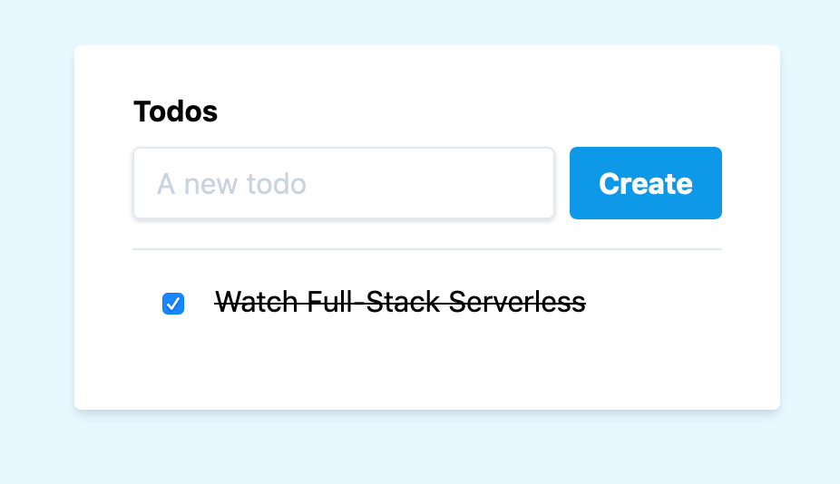
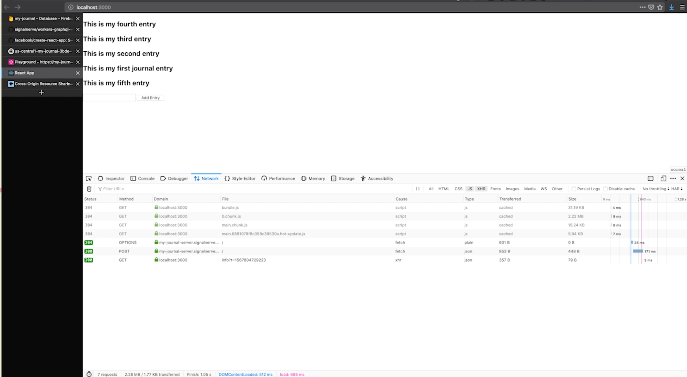

# Full Stack Serverless

Over the past few months, I've become fascinated with the concept of "full stack serverless": building fully featured applications – both the frontend and the backend – and deploying it to a platform where you don't worry about managing servers, downtime, or any of the usual operations issues around web projects.

In the Full Stack Serverless series, I'll explore how to build applications (with actual code!) and deploy them using serverless technology. This series will cover a number of applications, frameworks, and toolkits, with an eye towards understanding the what and the why of how serverless development works.

🐦 [Follow Bytesized Code on Twitter](https://twitter.com/bytesizedcode)

🐦 [Follow your host Kristian on Twitter](https://twitter.com/signalnerve)

This document contains a summary of each episode of Full Stack Serverless, as well as links to the source code for each project, links to each episode, and any additional information that might be relevant as you walk through the course.

Just a quick note: all of these videos are free, and the best thing you can do to help support Bytesized Code is to spread the word if you enjoyed the content! Bytesized is a solo project (hi!) and sharing this stuff with your friends, coworkers, and whoever you think would get some use out of it is a huge help. Thanks!

_Note: the below sections contain examples of code we'll be writing in the Full Stack Serverless series. Make sure to check out the full video, and the accompanying source code, for the complete versions of each code sample!_

---

## Full Stack Serverless, Project #1: Building a Todo List Application with Cloudflare Workers



[Live Preview](https://todos.signalnerve.workers.dev/) | [Source Code](https://github.com/signalnerve/cloudflare-workers-todos)

### Episode 1

In [episode 1](https://www.youtube.com/watch?v=94FYhNH4pcY), we look at creating a new project and defining a simple serverless function that returns a `Response` to a client.

```js
addEventListener('fetch', event => {
  event.respondWith(handleRequest(event.request))
})

/**
 * Fetch and log a given request object
 * @param {Request} request
 */
async function handleRequest(request) {
  return new Response('Hello worker!', { status: 200 })
}
```

### Episode 2

In [episode 2](https://www.youtube.com/watch?v=OxOYWxRCZMo), we create an HTML page and return it to the client. We also begin exploring using serverless key-value data stores to persist data to our users.

```js
const html = todos => `
<!DOCTYPE html>
<html>
  <head>
    <meta charset="UTF-8">
    <meta name="viewport" content="width=device-width,initial-scale=1">
    <title>Todos</title>
  </head>
  <body>
    <h1>Todos</h1>
  </body>
</html>
`

async function handleRequest(request) {
  return new Response(html(), {
    headers: { 'Content-Type': 'text/html' },
  })
}

addEventListener('fetch', event => {
  event.respondWith(handleRequest(event.request))
})
```

### Episode 3

In [episode 3](https://www.youtube.com/watch?v=GNkHWx7fSXE), we begin implementing client-side code to act upon persisted data from our key-value store, allowing the client to render a list of todos based on the data.

```js
const html = todos => `
<!DOCTYPE html>
<html>
  <head>
    <meta charset="UTF-8">
    <meta name="viewport" content="width=device-width,initial-scale=1">
    <title>Todos</title>
    <link href="https://cdn.jsdelivr.net/npm/tailwindcss/dist/tailwind.min.css" rel="stylesheet"></link>
  </head>
  <body class="bg-blue-100">
    <div class="w-full h-full flex content-center justify-center mt-8">
      <div class="bg-white shadow-md rounded px-8 pt-6 py-8 mb-4">
        <h1 class="block text-grey-800 text-md font-bold mb-2">Todos</h1>
        <div class="mt-4" id="todos"></div>
      </div>
    </div>
  </body>
  <script>
    window.todos = ${todos}

    var populateTodos = function() {
      var todoContainer = document.querySelector("#todos")
      todoContainer.innerHTML = null
      window.todos.forEach(todo => {
        var el = document.createElement("div")
        el.className = "border-t py-4"
        el.dataset.todo = todo.id
        var name = document.createElement("span")
        name.className = todo.completed ? "line-through" : ""
        name.textContent = todo.name
        var checkbox = document.createElement("input")
        checkbox.className = "mx-4"
        checkbox.type = "checkbox"
        checkbox.checked = todo.completed ? 1 : 0
        el.appendChild(checkbox)
        el.appendChild(name)
        todoContainer.appendChild(el)
      })
    }

    populateTodos()
  </script>
</html>
`
const getCache = key => KV_CACHE.get(key)

async function getTodos(request) {
  const ip = request.headers.get('CF-Connecting-IP')
  const cacheKey = `data-${ip}`
  let data
  const cache = await getCache(cacheKey)
  if (!cache) {
    await setCache(cacheKey, JSON.stringify(defaultData))
    data = defaultData
  } else {
    data = JSON.parse(cache)
  }
  const body = html(JSON.stringify(data.todos || []))
  return new Response(body, {
    headers: { 'Content-Type': 'text/html' },
  })
}

async function handleRequest(request) {
  return getTodos(request)
}

addEventListener('fetch', event => {
  event.respondWith(handleRequest(event.request))
})
```

### Episode 4

In [episode 4](https://www.youtube.com/watch?v=D-czoXufmS0), we wrap our todo list application project by implementing accompanying client and function code to handle new todos, and allow users to "update" (complete) their todos, updating the key-value data store accordingly.

See the [source code](https://github.com/signalnerve/cloudflare-workers-todos) to check out the completed project!

## Project 2: Building a Journal App with GraphQL, Firebase, and React



### Episode 5

In [episode 5](https://youtu.be/OmuMoIf2Vtg) of Full Stack Serverless, we begin a new project: a journaling application, implemented across three different codebases:

- A collection of Firebase functions that interface with Firestore, a NoSQL database from Google Firebase. [Find the source code here](https://github.com/signalnerve/fullstackserverless-journal-functions).
- An Apollo GraphQL server, which provides an interface to read and write from those functions. [Find the source code here](https://github.com/signalnerve/fullstackserverless-journal-graphql).
- A React application, which connects to the GraphQL server and allows querying and updating Firestore through that GraphQL server. [Find the source code here](https://github.com/signalnerve/fullstackserverless-journal-react).

In this episode, we begin by defining the Firebase project and an accompanying function to interface with our Firestore database.

```js
const functions = require('firebase-functions')
const admin = require('firebase-admin')
admin.initializeApp()
const db = admin.firestore()

exports.entries = functions.https.onRequest(async (request, response) => {
  const snapshot = await db.collection('entries').get()
  const entries = snapshot.empty
    ? []
    : snapshot.docs.map(doc => Object.assign(doc.data(), { id: doc.id }))
  response.send(entries)
})
```